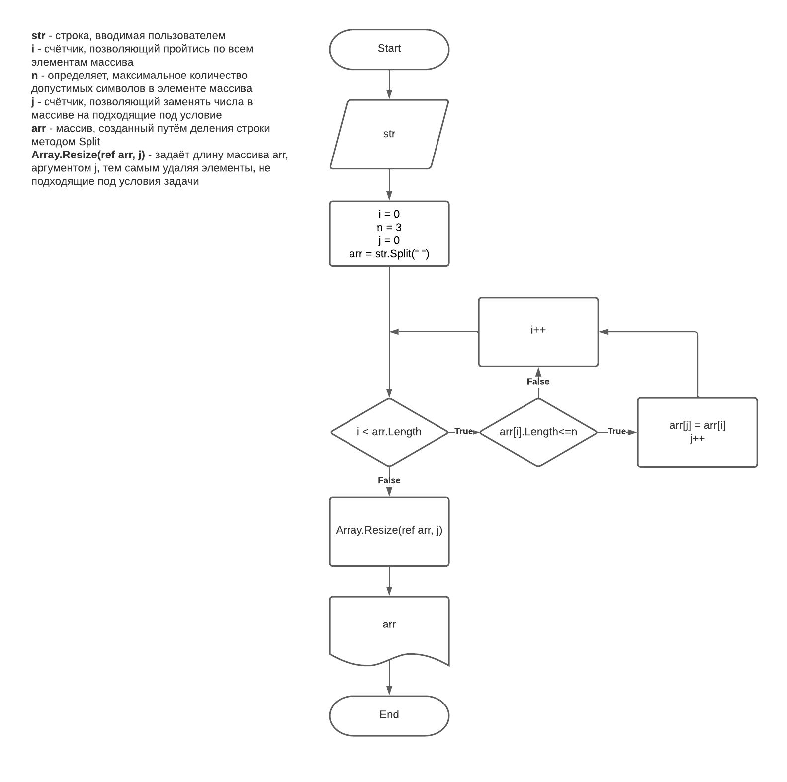

# **Контрольная работа**
## Задача
- Написать программу, которая из имеющегося массива строк формирует массив из строк, длина которых меньше либо равна 3 символа. Первоначальный массив можно ввести с клавиатуры, либо задать на старте выполнения алгоритма.
## Условия выполнения
- Репозиторий проекта на githab.
- Блок-схема алгоритма.
- Снабдить репозиторий оформленным текстовым  описанием решения .
- Написать программу, решающую поставленную задачу.
- Использовать контроль версий в работе над этим проектом.
## Используемые методы
- **string ReadData(string msg)** - Метод для получения данных от пользователя. Принимает значение **(string msg)**, которое выводится пользователю через консоль и возвращает значение, введеное пользователем в консоль.
- **string[] SortArrLess(string str, int n)** - Метод для отсеивания элементов массива. Первый аргумент **(string str)** принимает строку,  заполняет ею массив, дробя на элементы с помощью знака **(" ")** и отсеивает любой элемент, длина которго больше **(int n)**.
- **void PrintArr(string[] arr)** - Метод для вывода массива в консоль. Принимает и выводит в консоль массив строк **(string[] arr)**.
## Блок-схема
